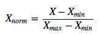

- 注册一个GitHub账号，并装好Git和GitHub Desktop。
- 安装pycharm、anaconda。
- 编写一个Python程序：
> 输入为一个100000x20的二维数组A
> 输出一个100000x20的二维数组B，数组B是数组A每列进行了归一化之后的结果。
> 归一化的方法为:

- 用自己的GitHub fork一份项目，并将项目clone到自己的电脑，将作业代码上传到自己分支